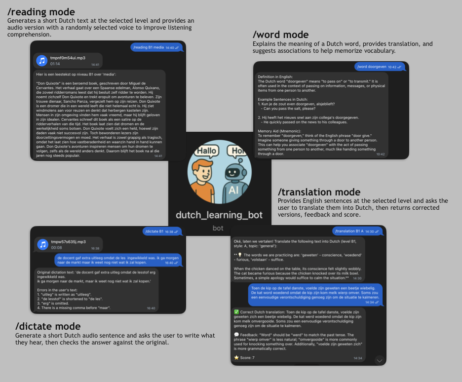

# 🇳🇱 Dutch Learning Telegram Bot

An interactive Telegram bot for practicing Dutch — integrates OpenAI GPT-4o to generate reading, translation, and listening exercises.

## Bot Interaction Preview


## ✨ Features
- `/start` – overview of all modes
- `/translation` – translate short texts with feedback and score
- `/reading` – read short texts (real or AI-generated) with audio
- `/dictate` – listen and write Dutch sentences
- `/word` – get definitions, examples, and synonyms
- `/explain` – grammar explanation in English

## 🧠 Tech Stack
- **Python 3.12**
- **python-telegram-bot 22**
- **OpenAI API (GPT-4o + TTS)**
- **Railway.app** for deployment

## 🧩 Project Structure
```
core/
├── app.py           # main application class
├── handlers/        # all command handlers
├── memory.py        # memory manager
└── openai_client.py # OpenAI wrapper
data/
└── memory.json      # user progress (local only)
config.py            # environment setup
bot.py               # entry point
```

## ⚙️ Running locally
1. Create a virtual environment:
   ```bash
   python -m venv venv && source venv/bin/activate
2.	Install dependencies:
    ```bash
    pip install -r requirements.txt
3.	Create a .env file:
    ```bash
    TELEGRAM_TOKEN=your_token
    OPENAI_API_KEY=your_key
    AUTHORIZED_USERS=123456789
4.	Run:
    ```bash
    python bot.py

🚀 Deployment

This bot is deployed on Railway.app.

🚀 [Try the bot on Telegram](https://t.me/dutch_learning_bot)
